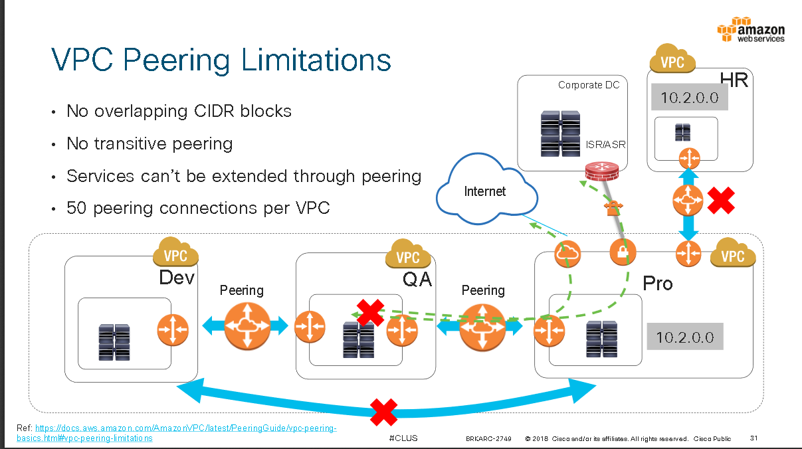
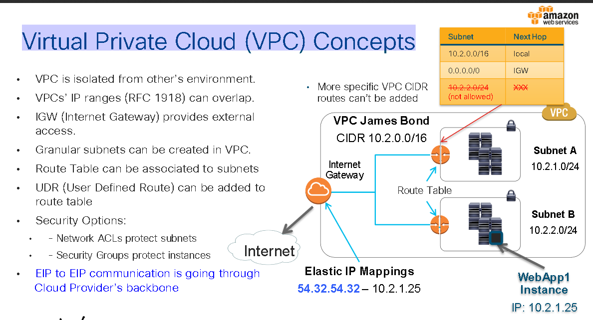

# Common AWS Networking Deployment
To show high level design of AWS Networking 

## Detail

### VPC peering  

- No overlapping CIDR blocks 
- No transitive peering
- Services can't be extended through peering
- 50 peering connections per VPC

### Virtual Private Cloud (VPC) Concepts  

## References 

CiscoLive
